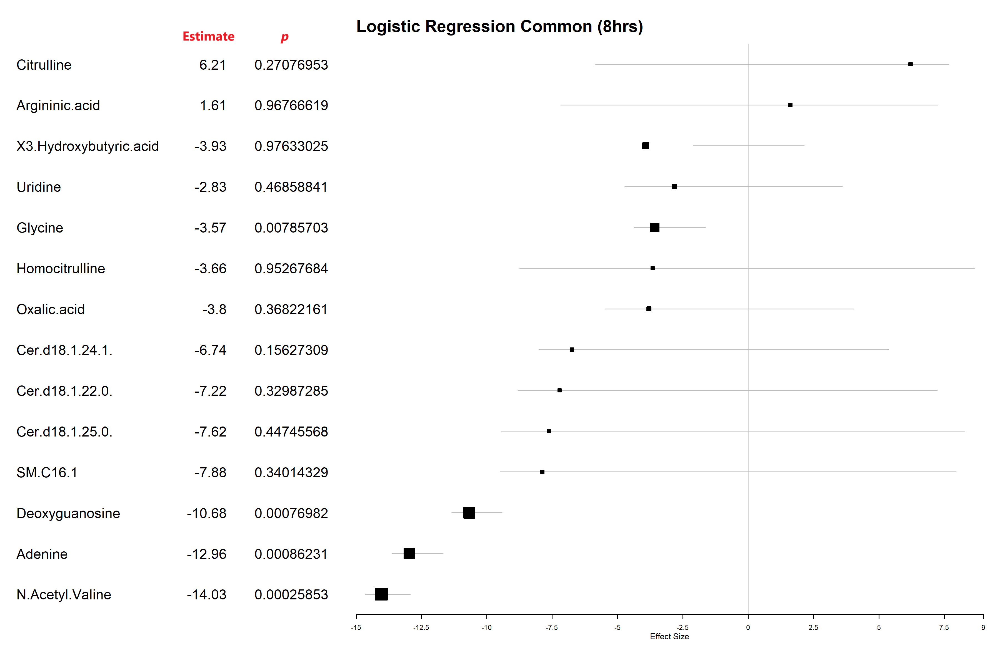

# Logistic Regression

### Early Stage (8 hrs)

| Term                | p-value      | Estimate | Lower   | Upper   |
|---------------------|--------------|----------|---------|---------|
| Adenine             | 0.000862314  | -12.96   | -13.63  | -11.68  |
| Argininic.acid      | 0.967666191  | 1.61     | -7.18   | 7.24    |
| Cer.d18.1.22.0.     | 0.329872848  | -7.22    | -8.81   | 7.23    |
| Cer.d18.1.24.1.     | 0.156273094  | -6.74    | -8.00   | 5.36    |
| Cer.d18.1.25.0.     | 0.447455677  | -7.62    | -9.46   | 8.28    |
| Citrulline          | 0.270769534  | 6.21     | -5.85   | 7.68    |
| Deoxyguanosine      | 0.000769819  | -10.68   | -11.34  | -9.42   |
| Glycine             | 0.007857025  | -3.57    | -4.37   | -1.64   |
| Homocitrulline      | 0.952676843  | -3.66    | -8.74   | 8.66    |
| N.Acetyl.Valine     | 0.000258526  | -14.03   | -14.65  | -12.92  |
| Oxalic.acid         | 0.368221613  | -3.80    | -5.47   | 4.04    |
| SM.C16.1            | 0.34014329   | -7.88    | -9.49   | 7.96    |
| Uridine             | 0.468588407  | -2.83    | -4.72   | 3.60    |
| X3.Hydroxybutyric.acid | 0.976330253 | -3.93 | -2.10   | 2.14    |

### Late Stage (24 hrs)

| Term                | p-value      | Estimate | Lower   | Upper   |
|---------------------|--------------|----------|---------|---------|
| Adenine             | 1.40E-05     | -14.84   | -15.37  | -13.97  |
| Argininic.acid      | 0.011674832  | 11.61    | 9.44    | 12.44   |
| Cer.d18.1.22.0.     | 0.251269094  | 8.72     | -8.23   | 10.16   |
| Cer.d18.1.24.1.     | 0.344739851  | -6.81    | -8.43   | 6.91    |
| Cer.d18.1.25.0.     | 0.909122674  | -5.85    | -10.03  | 9.86    |
| Citrulline          | 0.513725224  | 7.08     | -8.08   | 9.08    |
| Deoxyguanosine      | 0.000530582  | -10.47   | -11.12  | -9.27   |
| Glycine             | 0.037591046  | 2.63     | -1.49   | 3.59    |
| Homocitrulline      | 0.000195527  | 11.70    | 10.62   | 12.31   |
| N.Acetylputrescine  | 9.49E-05     | 18.12    | 17.12   | 18.71   |
| Oxalic.acid         | 7.44E-05     | 8.80     | 7.81    | 9.38    |
| SM.C16.1            | 0.136756073  | 9.95     | -8.30   | 11.16   |
| Uridine             | 0.000857977  | -6.47    | -7.14   | -5.19   |
| X3.Hydroxybutyric.acid | 0.000161533 | 4.14  | 3.08    | 4.74    |




From the logistic regression results, let's compare and interpret the significant metabolites (p < 0.05) identified at the early (8 hrs) and late (24 hrs) stages of *E. coli* infection in *Gallus gallus*. Here’s a breakdown:

### Key Observations and Interpretations
1. **Adenine**:
   - **Early**: Significantly decreased with an estimate of -12.96 (95% CI: -13.63 to -11.68, p = 0.00086).
   - **Late**: Decreased even further with an estimate of -14.84 (95% CI: -15.37 to -13.97, p = 1.40E-05).
   - **Interpretation**: Adenine levels show a strong, consistent reduction in both stages, suggesting it may be an essential early and late marker of infection. The increased effect size at the late stage indicates that adenine might progressively decrease as the infection progresses.

2. **Deoxyguanosine**:
   - **Early**: Significantly decreased with an estimate of -10.68 (95% CI: -11.34 to -9.42, p = 0.00077).
   - **Late**: Similarly decreased with an estimate of -10.47 (95% CI: -11.12 to -9.27, p = 0.00053).
   - **Interpretation**: Like adenine, deoxyguanosine levels are reduced at both stages, albeit with slightly less impact as infection progresses. It may serve as a consistent marker of infection status.

3. **N-Acetyl Valine**:
   - **Early**: Decreased significantly with an estimate of -14.03 (95% CI: -14.65 to -12.92, p = 0.00026).
   - **Late**: Not significant.
   - **Interpretation**: N-Acetyl Valine is significant only at the early stage, indicating it may play a role in the initial immune response or metabolic shift post-infection, but its importance fades over time.

4. **Homocitrulline**:
   - **Early**: Not significant.
   - **Late**: Increased significantly with an estimate of 11.70 (95% CI: 10.62 to 12.31, p = 0.0002).
   - **Interpretation**: Homocitrulline appears only in the late stage, potentially reflecting a delayed response or secondary metabolic adaptation during infection progression.

5. **Glycine**:
   - **Early**: Significantly decreased with an estimate of -3.57 (95% CI: -4.37 to -1.64, p = 0.0079).
   - **Late**: Increased with a modest significance (p = 0.037) and a positive estimate of 2.63.
   - **Interpretation**: Glycine shifts from being reduced at the early stage to being slightly elevated at the late stage. This could reflect a biphasic response where glycine initially drops as a result of infection stress, then recovers or adapts as the infection persists.

6. **Argininic Acid**:
   - **Early**: Not significant.
   - **Late**: Increased with an estimate of 11.61 (95% CI: 9.44 to 12.44, p = 0.011).
   - **Interpretation**: Argininic acid becomes significant only in the late stage, possibly reflecting an increase in metabolic activity or immune modulation as the host adapts to the infection.

7. **N-Acetylputrescine**:
   - **Late only**: Highly significant with an estimate of 18.12 (95% CI: 17.12 to 18.71, p = 9.49E-05).
   - **Interpretation**: The late-stage elevation suggests that N-Acetylputrescine may play a role in cellular stress responses or in late-stage inflammation.

8. **Oxalic Acid**:
   - **Early**: Not significant.
   - **Late**: Significant with an estimate of 8.80 (95% CI: 7.81 to 9.38, p = 7.44E-05).
   - **Interpretation**: Oxalic acid's significance only at the late stage suggests a possible link to metabolic byproducts accumulating as the infection matures.

9. **Uridine**:
   - **Early**: Not significant.
   - **Late**: Decreased with a significant estimate of -6.47 (95% CI: -7.14 to -5.19, p = 0.00086).
   - **Interpretation**: Uridine becomes relevant at the late stage, possibly due to prolonged metabolic demand affecting nucleotide synthesis or turnover.

10. **3-Hydroxybutyric Acid**:
    - **Early**: Not significant.
    - **Late**: Increased significantly with an estimate of 4.14 (95% CI: 3.08 to 4.74, p = 0.00016).
    - **Interpretation**: This metabolite is associated with energy metabolism, possibly indicating a shift towards ketogenesis or altered lipid metabolism at the late infection stage.

### Summary
- **Early Markers**: Adenine, Deoxyguanosine, Glycine, N-Acetyl Valine.
- **Late Markers**: Adenine, Deoxyguanosine, Homocitrulline, Argininic Acid, N-Acetylputrescine, Oxalic Acid, Uridine, and 3-Hydroxybutyric Acid.

These findings suggest a shift from an initial depletion of nucleotides and amino acids to a late-stage adaptation characterized by increased markers of cellular stress and altered energy metabolism.<br>
In the logistic regression analysis examining *E. coli* infection in *Gallus gallus*, distinct early and late metabolic markers emerged. At the early stage, key metabolites such as adenine, deoxyguanosine, glycine, and N-acetyl valine showed significant decreases, suggesting a rapid shift in nucleotide and amino acid metabolism likely linked to initial host immune and metabolic responses to infection. By the late stage, the profile evolved, with sustained decreases in adenine and deoxyguanosine, but a shift in glycine levels, from initially low to elevated. Unique to the late stage, metabolites such as homocitrulline, argininic acid, N-acetylputrescine, oxalic acid, uridine, and 3-hydroxybutyric acid displayed significant alterations, indicating ongoing metabolic adaptations. These late-stage markers likely reflect sustained metabolic stress, immune modulation, and shifts in energy metabolism, characteristic of an established infection. The overall pattern reveals a dynamic metabolic response that begins with a rapid depletion of certain metabolites and progresses to a complex adaptive state as the infection matures.


```R

```

## Batch2 unique (8hrs): Early Infection

| term | p.value | estimate | lower | upper |
| --- | --- | --- | --- | --- |
| N.Acetyl.Isoleucine | 0.000452443 | -12.52 | -13.16 | -11.34 |
| N.Acetyl.Alanine | 0.0000665 | -12.18 | -12.75 | -11.2 |
| Methylhistidine | 0.005305269 | 5.2 | 3.44 | 5.96 |
| Orotic.acid | 0.00021332 | -10.53 | -11.14 | -9.44 |
| Butyric.acid...Isobutyric.acid | 0.040450391 | 8.59 | 4.07 | 9.56 |


classification of the significant metabolites based on their association with *E. coli* infection at 8 hours post-infection:

### Positive Association with *E. coli* Infection:
- **Methylhistidine**
- **Butyric acid / Isobutyric acid**

### Negative Association with *E. coli* Infection:
- **N-Acetyl Isoleucine**
- **N-Acetyl Alanine**
- **Orotic acid**

### Conclusion
The top metabolites that could be utilized as unique early markers for *E. coli* infection in *Gallus gallus* include **N-Acetyl Isoleucine** and **N-Acetyl Alanine** for their strong negative association, as well as **Methylhistidine** and **Butyric acid / Isobutyric acid** for their positive association. These markers may effectively represent the metabolic shifts unique to the early infection stage.


```R

```

## Batch1 unique (24hrs): Late Infection

| term | p.value | estimate | lower | upper |
| --- | --- | --- | --- | --- |
| Hippuric.acid | 0.001797426 | 19.59 | 18.17 | 20.3 |
| CE.22.2. | 0.002087139 | 16.95 | 15.49 | 17.66 |
| N1.Acetylspermidine | 0.000576706 | 15.38 | 14.16 | 16.03 |
| Picolinic.acid | 0.000231924 | 13.31 | 12.22 | 13.93 |
| Malonic.acid | 0.0157163 | 13.23 | 10.82 | 14.08 |
| Propionic.acid | 0.000405914 | 12.28 | 11.12 | 12.92 |
| Valeric.acid...Isovaleric.acid | 0.000230645 | 11.97 | 10.88 | 12.59 |
| Asymmetric.dimethylarginine | 0.019547231 | 11.27 | 8.63 | 12.15 |
| X3.Hydroxyisovaleric.acid | 0.0000871 | 10.9 | 9.9 | 11.48 |
| X3.4.Dihydroxybutyric.acid | 0.0000813 | 10.73 | 9.74 | 11.32 |
| N.Acetyl.Glutamine | 0.039974416 | 10.62 | 6.17 | 11.59 |
| X2.hydroxyglutaric.acid | 0.00017202 | 10.21 | 9.15 | 10.82 |
| X4.Hydroxyphenylpyruvic.acid | 0.000280122 | 7.59 | 6.48 | 8.22 |
| alpha.Ketoglutaric.acid | 0.003151294 | 7.45 | 5.88 | 8.19 |
| Pyruvic.acid | 0.007429981 | 6.91 | 5.01 | 7.71 |
| Phenylalanine | 0.000172717 | 6.35 | 5.29 | 6.96 |
| Citric.acid | 0.000143039 | 3.96 | 2.92 | 4.56 |
| Uric.acid | 0.0000862 | 3.72 | 2.72 | 4.31 |
| Proline | 0.04357787 | 2.39 | -2.72 | 3.37 |
| Betaine | 0.049929212 | 2.05 | -9.7 | 3.05 |
| Cytidine | 0.000298786 | -4.25 | -4.87 | -3.12 |
| Cystathionine | 0.000185653 | -4.63 | -5.24 | -3.56 |
| LysoPC.a.C18.1 | 0.009339677 | -6.85 | -7.66 | -4.83 |
| Deoxycytidine | 0.000757869 | -7.07 | -7.73 | -5.81 |
| Spermine | 0.015238455 | -8.99 | -9.85 | -6.62 |
| Deoxyinosine | 0.026182984 | -9.26 | -10.17 | -6.18 |
| Spermidine | 0.01852798 | -9.87 | -10.74 | -7.29 |
| Deoxyadenosine | 0.003871802 | -12.48 | -13.23 | -10.84 |
| Adenosine | 0.005304555 | -13.39 | -14.15 | -11.63 |
| Phenylethylamine | 0.002436472 | -15.23 | -15.95 | -13.73 |

**Significant metabolites**


Classification of the significant metabolites based on their association with *E. coli* infection at 24 hours post-infection:

### Positive Association with *E. coli* Infection:
- **Hippuric acid**
- **CE 22:2**
- **N1-Acetylspermidine**
- **Picolinic acid**
- **Malonic acid**
- **Propionic acid**
- **Valeric acid / Isovaleric acid**
- **Asymmetric dimethylarginine**
- **3-Hydroxyisovaleric acid**
- **3,4-Dihydroxybutyric acid**
- **N-Acetyl Glutamine**
- **2-Hydroxyglutaric acid**
- **4-Hydroxyphenylpyruvic acid**
- **alpha-Ketoglutaric acid**
- **Pyruvic acid**
- **Phenylalanine**
- **Citric acid**
- **Uric acid**
- **Proline**
- **Betaine**

### Negative Association with *E. coli* Infection:
- **Cytidine**
- **Cystathionine**
- **LysoPC a C18:1**
- **Deoxycytidine**
- **Spermine**
- **Deoxyinosine**
- **Spermidine**
- **Deoxyadenosine**
- **Adenosine**
- **Phenylethylamine**


### Conclusion
The most notable metabolites with strong associations to *E. coli* infection at the 24-hour mark, indicating potential as late markers, include **Hippuric acid**, **N1-Acetylspermidine**, and **Picolinic acid** for their significant positive associations, as well as **Phenylethylamine** and **Adenosine** for their negative associations. These markers demonstrate substantial shifts in metabolite levels, suggesting their effectiveness in distinguishing the late infection phase.


```R

```


